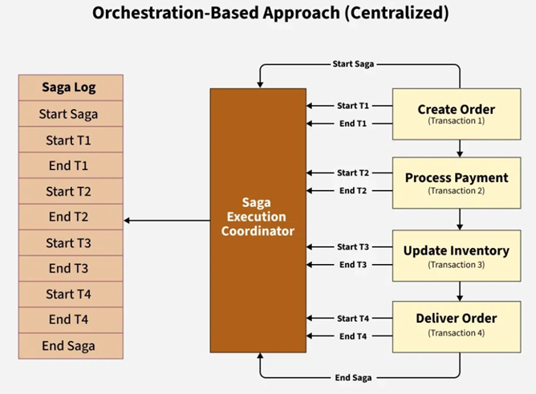
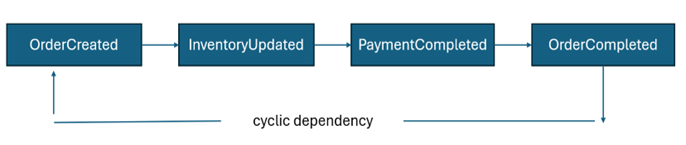
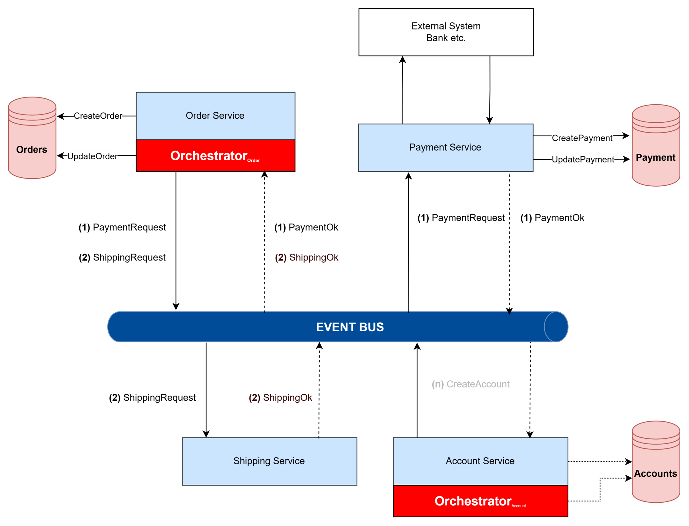

# Chord
Chord is a lightweight flow definition and runtime model that enables deterministically observable, payload-only and rollback-aware coordination of multi-service workflows in event-driven microservice environments, providing clear visibility into flow state, step progression, and failure or rollback behavior without centralized control.

## Problem Definition
The Saga pattern is one of the most common approaches used to maintain data consistency in distributed transactions within microservice architectures. The Saga pattern is typically implemented in two ways.

## Orchestrated Saga 
increases visibility and simplifies the management of workflow steps, errors, and compensation by using a central component to control the process. However, the central structure may create a Single Point of Failure (SPOF) and carries the risk of performance bottlenecks under high traffic.

### Advantages of Orchestrated Saga 

The main advantages of the Saga Orchestration model are as follows:

- **Centralized Control:** Centralized orchestration provides strong control over complex business workflows.
- **Debugging and Observability:** A centralized control flow significantly simplifies tracking, monitoring, and debugging the overall system execution. The state and progress of processes can be observed at runtime.
- **Suitable for Complex Processes:** It is more suitable for complex workflows and sequential processes that require tight coordination.
- **Simplicity:** Since the orchestration manages the workflow, service developers are relieved from tracking or managing complex global states. Instead, they focus on simpler tasks such as executing commands received from the orchestrator.
- **Ease of Update and Maintenance:** Adding a new step or modifying an existing process is performed and tested centrally.
- **Error Handling:** When an error occurs at any step of a sequential process, the orchestrator executes compensation actions to roll back the changes made by previous local transactions. Developers only need to implement the rollback logic for their own operations.

### Disadvantages of Orchestrated Saga 

- **Single Point of Failure:** The centralized nature of orchestration introduces a risk to system availability. If the orchestration system fails or becomes unavailable, serious issues may arise across the entire application.
- **Performance Bottleneck:** The performance of the orchestration system directly affects the overall system throughput. In large-scale applications with high traffic and many services, the orchestrator can become a bottleneck and therefore must be carefully monitored.
- **High Resource Consumption:** Academic studies have shown that, under the same workload, Saga Orchestration consumes more CPU and RAM compared to Saga Choreography and the Two-Phase Commit (2PC) model.

## Choreographed Saga
Choreographed Saga, on the other hand, is a decentralized model in which services trigger each other through events. This approach enables looser coupling and better horizontal scalability; however, since control is distributed across services, it becomes difficult to trace which step the process is currently in. In case of failure, the rollback mechanism is often dependent on compensating events initiated by services themselves, which increases coordination cost and operational complexity.

### Advantages of Choreographed Saga

- **No Single Point of Failure:** Since there is no centralized control point, the system does not suffer from a single point of failure.
- **High Scalability:** This approach does not introduce a system-wide bottleneck and therefore provides high scalability. It is especially suitable for high-throughput, event-driven systems.
- **Loose Coupling and Autonomy:** As services communicate asynchronously via messages, the architecture promotes loose coupling and service autonomy.
- **High Performance:** Without the overhead of a centralized controller, it typically delivers lower response times and higher throughput (TPS).
- **Lower Communication Overhead:** Compared to orchestration, it requires fewer operations in both successful and failed execution scenarios.

### Disadvantages of Choreographed Saga

- **Low Visibility and Monitoring Difficulty:** Due to the absence of a centralized control flow, it is difficult to track the current stage of a process, perform debugging, and effectively monitor the system.
- **Complexity:** As the number of services and process steps increases, managing the overall workflow becomes challenging. Developers may need to understand the application as a whole, similar to monolithic architectures.
- **Cyclic Dependencies:** When services emit events in a chained manner, an incorrect design can lead to cyclic triggering. In such cases, the system may repeatedly trigger itself, effectively spamming its own event flow.

- **Difficulty in Updates and Changes:** In systems where microservices are frequently added or removed, modifying the workflow requires code changes across multiple services. This significantly increases delivery times.
- **Integration Testing Challenges:** Since all involved services must be running to simulate a complete process, preparing and executing integration tests becomes more difficult.

## Why Is an Alternative to Saga Orchestration and Saga Choreography Needed?

Although the Saga pattern is the most widely adopted solution for distributed transaction management in microservice architectures, the two existing approaches exhibit distinct advantages and disadvantages, making architectural decision-making challenging.

The **Saga Orchestration** model provides centralized coordination, which simplifies the control, observability, and error handling of complex business workflows. However, this centralized structure also introduces a **Single Point of Failure**, carries the risk of becoming a bottleneck under high load, and— as demonstrated in the literature— may result in higher CPU and RAM consumption.

On the other hand, the **Saga Choreography** approach does not rely on centralized control, enabling high scalability, loose coupling, lower communication overhead, and improved performance. Nevertheless, the independent, event-driven progression of services makes system observability and debugging more difficult. As the number of services increases, workflow complexity grows, and poorly designed event flows may lead to **cyclic dependencies**, increasing the risk of uncontrolled event loops.

Therefore, it is evident that neither approach alone is universally suitable for all scenarios. In practical systems, factors such as performance, observability, fault tolerance, operational complexity, and cost must be carefully evaluated when selecting an appropriate Saga implementation strategy. The limited number of hybrid approaches in the literature and the insufficient exploration of real-world application scenarios form the primary motivation for considering Saga Orchestration and Saga Choreography as complementary or alternative models.

While several studies compare Saga Orchestration and Saga Choreography, research proposing a hybrid model that combines the strengths of both while mitigating their weaknesses remains scarce. 

Moreover, comprehensive qualitative and quantitative analyses examining the impact of Saga patterns on developer experience, debugging effort, operational complexity, and management cost are still limited.

## Conceptual Explanation of the Chord Approach

The core idea behind **Chord** is to avoid managing the entire transaction flow through a single, centralized orchestrator. Instead, each domain microservice hosts a lightweight orchestration component internally.

In this way, services do not rely on long event chains to trigger one another directly, while observability is preserved since control over the process is not fully dispersed.

In the Chord approach, the domain microservice that initiates the workflow is equipped with Chord. After completing its own business logic, this service triggers the workflow through Chord and performs no further orchestration-related actions. From this point onward, Chord follows the workflow defined in its YAML configuration and dispatches commands to the next service via the message bus.

The receiving service does **not** need to reference or include the Chord library. Once it completes its operation successfully, it sends a message to the **Chord Success queue**, allowing Chord to proceed to the next step in the workflow. If the service fails to complete its operation, it sends a message to the **Chord Fail queue**, upon which Chord sequentially initiates the defined compensation actions.

Chord can also trigger compensation workflows by monitoring timeouts of the services it invokes. In addition, by tracking the health status of services, Chord can notify the domain service (host) to avoid triggering the workflow chain. Depending on configuration, Chord may also actively prevent the workflow from being started.

### Saga Orchestration – Choreography – Chord Comparison Table

| Criteria | Orchestration | Choreography | **Chord** |
|--------|---------------|--------------|-----------|
| **Control Model** | Managed by a central orchestrator | Services trigger each other by emitting events | Services that require it host a **local orchestrator** |
| **Coupling** | Strong dependency on the central orchestrator | High event-based coupling between services | Loosely coupled services with controlled flow |
| **Observability & Debugging** | Easy (single centralized logging point) | Difficult (event chains are distributed) | Easy to moderate (each service logs, flow is traceable) |
| **Error Handling** | Centralized rollback, easy to manage | Rollback is difficult and complex | Local orchestration executes compensation scenarios |
| **Scalability** | Central orchestrator may become a bottleneck | Very high scalability | High scalability due to distributed orchestration |
| **Performance** | Additional orchestrator overhead | Fast event routing | Efficient; avoids central bottlenecks |
| **SPOF Risk** | High (orchestrator failure halts the system) | None (fully distributed) | None (multiple small orchestrators) |
| **Complexity** | Increases as orchestrator grows | Grows exponentially with event count | Modular, service-level control |
| **Operational Management** | Visible but with centralized operational load | Difficult to monitor and manage | Balanced observability with distributed reliability |
| **Flexibility** | Flow changes are made at the orchestrator | Event routing changes are costly | YAML-defined dynamic flows |
| **Use Cases** | Critical transactional workflows | Event-driven domain processes | Hybrid scenarios, adaptive workflows |
| **Overall Evaluation** | Strong control but highly centralized | Lightweight and flexible but hard to manage | **Hybrid approach combining strengths of both models** |

The comparison of Saga Orchestration, Saga Choreography, and the Chord approach highlights that each model addresses different system requirements with distinct strengths and limitations. Saga Orchestration provides strong centralized control, making it particularly suitable for critical and sequential transactional workflows where observability, debugging, and centralized rollback management are essential. However, this centralized design introduces a single point of failure, increases the risk of performance bottlenecks under high load, and may lead to higher operational and resource costs. In contrast, Saga Choreography eliminates centralized coordination by allowing services to progress through event-based interactions, resulting in high scalability, loose coupling, and lower communication overhead. Nevertheless, as the number of services grows, event chains become harder to manage, system observability decreases, and the risk of cyclic dependencies increases, making debugging and operational control more challenging.

The Chord approach positions itself as a hybrid solution between these two extremes. By embedding a lightweight orchestration component only within domain services that require flow control, Chord avoids the drawbacks of a single centralized orchestrator while preserving a sufficient level of observability. Workflow execution is distributed, improving scalability and fault tolerance, yet remains manageable through YAML-defined flows that clearly describe process steps and transitions. As a result, Chord combines the strong control and error-handling capabilities of orchestration with the performance and distribution benefits of choreography, offering a balanced and practical alternative for real-world microservice-based systems.
