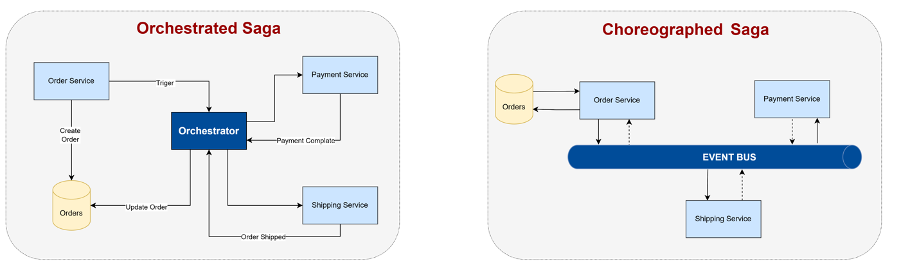

# Chord
Chord is a lightweight flow definition and runtime model that enables deterministically observable, payload-only and rollback-aware coordination of multi-service workflows in event-driven microservice environments, providing clear visibility into flow state, step progression, and failure or rollback behavior without centralized control.

## Problem Definition
The Saga pattern is one of the most common approaches used to maintain data consistency in distributed transactions within microservice architectures. The Saga pattern is typically implemented in two ways.

## Orchestrated Saga 
increases visibility and simplifies the management of workflow steps, errors, and compensation by using a central component to control the process. However, the central structure may create a Single Point of Failure (SPOF) and carries the risk of performance bottlenecks under high traffic.

### Advantages of Orchestrated Saga 

The main advantages of the Saga Orchestration model are as follows:

- **Centralized Control:** Centralized orchestration provides strong control over complex business workflows.
- **Debugging and Observability:** A centralized control flow significantly simplifies tracking, monitoring, and debugging the overall system execution. The state and progress of processes can be observed at runtime.
- **Suitable for Complex Processes:** It is more suitable for complex workflows and sequential processes that require tight coordination.
- **Simplicity:** Since the orchestration manages the workflow, service developers are relieved from tracking or managing complex global states. Instead, they focus on simpler tasks such as executing commands received from the orchestrator.
- **Ease of Update and Maintenance:** Adding a new step or modifying an existing process is performed and tested centrally.
- **Error Handling:** When an error occurs at any step of a sequential process, the orchestrator executes compensation actions to roll back the changes made by previous local transactions. Developers only need to implement the rollback logic for their own operations.

### Disadvantages of Orchestrated Saga 

- **Single Point of Failure:** The centralized nature of orchestration introduces a risk to system availability. If the orchestration system fails or becomes unavailable, serious issues may arise across the entire application.
- **Performance Bottleneck:** The performance of the orchestration system directly affects the overall system throughput. In large-scale applications with high traffic and many services, the orchestrator can become a bottleneck and therefore must be carefully monitored.
- **High Resource Consumption:** Academic studies have shown that, under the same workload, Saga Orchestration consumes more CPU and RAM compared to Saga Choreography and the Two-Phase Commit (2PC) model.

## Choreographed Saga
Choreographed Saga, on the other hand, is a decentralized model in which services trigger each other through events. This approach enables looser coupling and better horizontal scalability; however, since control is distributed across services, it becomes difficult to trace which step the process is currently in. In case of failure, the rollback mechanism is often dependent on compensating events initiated by services themselves, which increases coordination cost and operational complexity.

### Advantages of Choreographed Saga

- **No Single Point of Failure:** Since there is no centralized control point, the system does not suffer from a single point of failure.
- **High Scalability:** This approach does not introduce a system-wide bottleneck and therefore provides high scalability. It is especially suitable for high-throughput, event-driven systems.
- **Loose Coupling and Autonomy:** As services communicate asynchronously via messages, the architecture promotes loose coupling and service autonomy.
- **High Performance:** Without the overhead of a centralized controller, it typically delivers lower response times and higher throughput (TPS).
- **Lower Communication Overhead:** Compared to orchestration, it requires fewer operations in both successful and failed execution scenarios.

### Disadvantages of Choreographed Saga

- **Low Visibility and Monitoring Difficulty:** Due to the absence of a centralized control flow, it is difficult to track the current stage of a process, perform debugging, and effectively monitor the system.
- **Complexity:** As the number of services and process steps increases, managing the overall workflow becomes challenging. Developers may need to understand the application as a whole, similar to monolithic architectures.
- **Cyclic Dependencies:** When services emit events in a chained manner, an incorrect design can lead to cyclic triggering. In such cases, the system may repeatedly trigger itself, effectively spamming its own event flow.

[cyclic_dependency.png]

- **Difficulty in Updates and Changes:** In systems where microservices are frequently added or removed, modifying the workflow requires code changes across multiple services. This significantly increases delivery times.
- **Integration Testing Challenges:** Since all involved services must be running to simulate a complete process, preparing and executing integration tests becomes more difficult.

